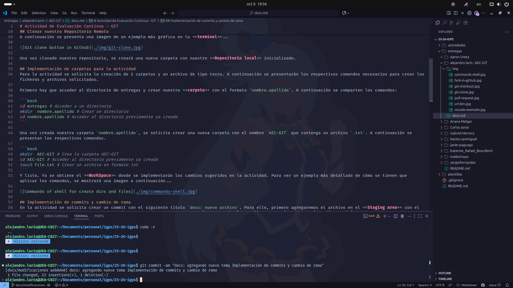

# Actividad de Evaluación Continua - GIT
## Hacer Fork del repositorio
Para hacer el **Fork** del repositorio para ello se tiene acceder al [Repositorio oficial de IGPS](https://github.com/miguelancabezon/25-26-igps) y hacer un fork del repositorio. Para ello es nesesario darle click al boton que se muestra a continuación.


Una vez echo el **Fork** en nuestro repositorio pasamos al siguiente paso...

## Clonar nuestro Repositorio Remoto
En este caso para clonar el repositorio se utilizara  el protocolo `HTTPS` para conseguir la  `URL` de nuestro repositorio  remoto de **GitHub** tienes que entrar al repositorio en donde se realizo el fork y copiar la `URL`. A continuación se presenta una imagen de ejemplo de como obtener la `URL` de nuestro repositorio.


Una vez se obtenga la `URL` en la terminal del dispositivo **Local** es nesesario escribir el siguiente comando `git clone <URL>` a continuación se presenta un ejemplo en como se debe aplicar el comando.

```bash
git clone https://github.com/alejandro-larin/25-26-igps.git # Comando para clonar el repositorio remoto.
```
A continuación se presenta una imagen de un ejemplo mas grafico en la **terminal**...


Una vez clonado nuestro repositorio se creara una nueva carpeta con nuestro **Repositorio local** inicializado.

## Implementación de carpetas para la actividad
Para la actividad se solicita la creación de 2 carpetas y un archivo de tipo texto a continuación se presentaran los respectivos comandos nesesarios para crear los ficheros y archivos solicitados.

Primero hay que acceder al directorio de entregas y crear nuestra **carpeta** con el formato `nombre.apellido` a continuación se comparten los comandos:

```bash
cd entregas # Acceder a un directorio
mkdir  nombre.apellido # Crear un directorio
cd nombre.apellido # Acceder al directorio previamente ya creado
```

Una vez creado nuestra carpeta `nombre.apellido` se solicita crear una nueva carpeta con el nombre `AEC-GIT` que contenga un archivo `.txt`. A continuación se presentan los respectivos comandos.

```bash
mkdir  AEC-GIT # Crea la carpeta AEC-GIT
cd AEC-GIT # Acceder al directorio previamente ya creado
touch file.txt # Crear un archivo en formato txt
```
Y  listo. Ya se obtiene el **WorkSpace** donde se implementaran los cambios sugeridos en la actividad. Para ver un ejemplo mas detallado de como se tienen que aplicar los comandos se mostrara una imagen a continuación...


## Implementación de commits y cambio de rama
En la actividad se solicita crear un commit con el siguiente titulo `docs: nuevo archivo` para ello primero agregaremos el archivo en el **Staging area** con el comando `git add .` con este comando le estamos diciendo a git **"Agregame todos los cambios que esten en este mismo directorio"**.

Una vez agregado se tiene que realizar el `commit` con el titulo `docs: nuevo archivo` con el comando `git commit -m "<title>"`, este comando es para **capturar una imagen del codigo del proyecto en ese presiso momento** tambien llamados **Puntos de control** o **Instantaneas**  a continuancion se presentan los comandos nesesarios para la implentacion del `commit`.

```bash
git add . # Agregar cambios al Staging area
git commit -m "docs: nuevo archivo" # Crear un Punto de Control
```

Una vez ya realizado el `commit` se solicita crear una rama con el nombre `docs/modificaciones`, para realizar esta acción hay varias alternativas pero en este caso se usara el comando `git checkout` con la flag `-b` el comando completo seria `git checkout -b <BRANCH-NAME>`, con este comando le decimos a git creame una rama con un nombre en especifico y cambiate a ella a continuación se presenta el comando.

```bash
git checkout -b docs/modificaciones # COmando para crear y cambiarse  a la rama docs/modificaciones
```

Una vez echo el comando usted estara en una rama nueva, A continuacion se presenta un ejemplo mas grafico aplicando el mismo comando en la terminal.


 
## Implementacion de la documentacion
Para la implentacion de la documentacion se tienen que realizar un `commit` por imagen y algunos `commits` por temas esto depende de cada persona, en este caso se hiso un `commit` tipo `docs` de 3 temas y los demas `commits` fueron echos por cada tema. Para esta documentacion se decidio reutilizar el archivo `file.txt` y cambiarla a formato `md`.

- Es importante siempre haceer un commit despues de cambiar el nombre, mover o borrar un archivo ya que git lo toma como si un archivo fue borrado y creado otro.

A continuacion se presenta un ejemplo mas grafico de como debe ser la estructura de  nuestro **Work Space**.


 
Una vez implementada la documentacion se pasa a la parte final.

